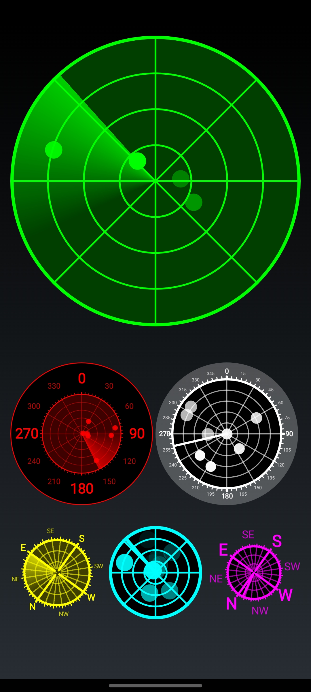

# SonarView
Custom Android View imitating a sonar. Points appear on sonar after being detected for a specified amount of time. The location where they appear depends on their parameters and device's rotation. Touching the view makes it detect points faster.
### Usage
Declaring view in layout:
```xml
    <tw0reck1.sonar.SonarView
        android:id="@+id/sonarview"
        android:layout_width="match_parent"
        android:layout_height="wrap_content"
        android:padding="12dp"
        app:sv_color="#0f0"/>
```
Setup code:
```kotlin
...
    val sonarView = findViewById<SonarView>(R.id.sonarview)
    val sonarPoints = listOf(
        SonarPoint(0, 0.5f), // angle when facing north; distance from center;
        SonarPoint(30, 1f),
        SonarPoint(60, 0.8f),
        SonarPoint(120, 0.4f),
        SonarPoint(180, 0.6f),
        SonarPoint(225, 0.7f)
    )
    sonarView.setPoints(sonarPoints)
    sonarView.startAnimation()
...
```

### Samples
